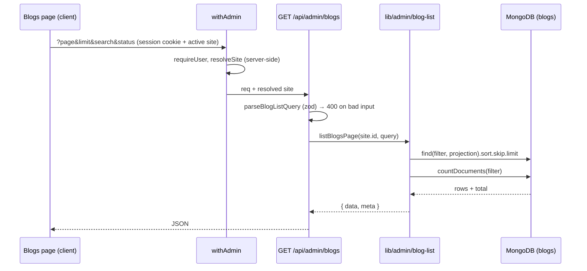

# CogCMS

A self-hostable, multi-site headless CMS built with Next.js 16, React 19, MongoDB/Mongoose, TypeScript and Vitest. Manage blogs, authors, FAQs, whitepapers and release notes in one editorial workspace, and deliver published content to your websites through a versioned API or restricted MongoDB views.

The CMS includes site-scoped users and API keys, editorial previews, stored blog rendering, signed publishing notifications, newsletter and FAQ intake, and optional S3 media uploads. Websites own their presentation. Start with the local demo below or [set up your own installation](docs/DEPLOYMENT.md).

## Local setup

Use Node 22 (`.nvmrc`), npm, **MongoDB 8.2.5** and MongoDB Shell (`mongosh`) for this local recipe. The CMS requires a replica set for transactional paths. Media upload is optional and disabled when the three `S3_*` values are unset.

Get the source and enter the project directory:

```sh
git clone https://github.com/mundra-aman/CogCMS.git
cd CogCMS
```

Then complete these steps from that directory:

1. Create an empty local data directory and start MongoDB with `mongod --replSet rs0 --bind_ip 127.0.0.1 --port 27017 --dbpath <empty-local-directory>`. In a second terminal, connect with `mongosh mongodb://localhost:27017` and run `rs.initiate({_id: 'rs0', members: [{_id: 0, host: 'localhost:27017'}]})` once. Do not point these commands at a shared database.
2. Run `npm ci`, copy `.env.example` to `.env`, and set a new local `CMS_JWT_SECRET` (at least 32 characters) and local `CMS_SEED_ADMIN_PASSWORD` (at least 12 characters). The example email is fictional. Keep `MONGODB_DB_NAME=cms_public_demo` and `MONGODB_URI=mongodb://localhost:27017/?replicaSet=rs0`.
3. Run `npm run seed:admin`, `npm run ensure:indexes`, then `npm run seed:demo`. The demo seed refuses remote MongoDB targets, any database name other than `cms_public_demo`, and an existing site or blog. It creates two fictional sites and 48 blogs; it never overwrites existing records.
4. Run `npm run dev` and open `http://localhost:3003/admin/login`. Sign in with the local admin, then choose **Northstar Studio** or **Harbor Notes** from the site selector. Explore the editors or create a site of your own. The demo has no public website, so its public View links are illustrative.

To reset, stop the app and verify that the target is your disposable local `cms_public_demo` database before dropping it with `mongosh`; then repeat the seed commands. No reset command is bundled so a copied command cannot silently erase another database.

## Server-side blog list

### Feature overview

Before this change, the admin **Blogs** page downloaded every blog for the active site, including each article body and its rendered HTML snapshot, then searched and filtered that array in the browser. Both page weight and render time grew with every post. The list now asks the server for one page at a time. Search, the status filter, counting and pagination all run in MongoDB, and only the six fields the list shows are sent back.

`GET /api/admin/blogs` accepts:

| Parameter | Default | Rule                                                                                  |
| --------- | ------- | ------------------------------------------------------------------------------------- |
| `page`    | `1`     | Positive whole number; `(page - 1) × limit` must be a safe integer                    |
| `limit`   | `20`    | Whole number from 1 to 100                                                            |
| `search`  | empty   | Trimmed, at most 100 characters, literal case-insensitive match on title, slug or tag |
| `status`  | `all`   | `all`, `draft` or `publish`                                                           |

It returns `{ data, meta: { page, limit, total, totalPages } }`. Each row holds only `_id`, `title`, `slug`, `status`, `tag` and `createdAt`. Invalid input returns HTTP 400 in the existing `{ error, code: 'VALIDATION_ERROR', details }` envelope, and so does a parameter that appears more than once.

### Architecture



- **Validation** (`lib/validation/blog-list.ts`) turns the query string into a typed `{ page, limit, search, status }` object, or a field-by-field error.
- **Query** (`lib/admin/blog-list.ts`) builds one filter and runs the page query and the count with that same filter. `siteId` is always set from the site that `withAdmin` resolved from the session, and it is assigned last, so a `siteId` query parameter is ignored and cannot widen the scope. Rows and counts are therefore both site-scoped.
- **Projection**: `find()` is given `{ _id, title, slug, status, tag, createdAt }`, so MongoDB itself leaves out `content`, `rendered`, FAQs and SEO fields. They never reach Node, let alone the browser. `.lean()` skips Mongoose document hydration, and each row is then mapped to a plain object with exactly those six keys.
- **Ordering** is `createdAt` descending, then `_id` descending. Posts that share a timestamp keep a fixed order, so no post appears on two pages or is skipped.
- **Admin UI** (`app/admin/dashboard/blogs/page.tsx`) holds `search`, `status` and `page` in state, and fetches whenever they or the active site change.
- **Related posts picker** (`components/blog-editor/RelatedPicker.tsx`) used to rely on the full list. It now searches the same endpoint as the editor types.

### Design decisions and trade-offs

| Decision                                                    | Alternative considered                       | Why                                                                                                                                                                                                                                                                                                                  | Cost                                                                                                                                                                                            |
| ----------------------------------------------------------- | -------------------------------------------- | -------------------------------------------------------------------------------------------------------------------------------------------------------------------------------------------------------------------------------------------------------------------------------------------------------------------- | ----------------------------------------------------------------------------------------------------------------------------------------------------------------------------------------------- |
| **Escaped `$regex`** with `$options: 'i'`                   | A `$text` index, or Atlas Search             | The spec asks for literal substring matching; for example, "ice" should find "pricing". `$text` matches whole stemmed words, and Atlas Search is not available on a local replica set. Every regex metacharacter is escaped, so `a+b` matches only the text `a+b` and input can never become a pattern such as `.*`. | An unanchored regex cannot use an index, so a search reads every blog **within the site**. The `siteId` index narrows that first. Fine at editorial volumes; see future work for large sites.   |
| **Offset pagination** (`skip`/`limit`)                      | Cursor pagination (`after=<createdAt,_id>`)  | The UI needs "page N of M" and a total, which offsets give directly, and the spec defines the contract in page numbers.                                                                                                                                                                                              | Deep pages get slower, and pages can shift if posts are created while you page.                                                                                                                 |
| **`find` and `countDocuments` in parallel** (`Promise.all`) | One `$facet` aggregation                     | Simple, easy to review, and uses the model's projection and sort directly. Both queries use the same filter.                                                                                                                                                                                                         | Two reads instead of one: a post created between them can make `total` off by one for that response.                                                                                            |
| **Projection inside the query**                             | Fetch full documents and drop fields in Node | `content`, `rendered`, FAQs and SEO fields never leave MongoDB, so they cost no memory or bandwidth.                                                                                                                                                                                                                 | None.                                                                                                                                                                                           |
| **Strict digit-only parsing**                               | `Number()` or `z.coerce.number()`            | `Number('1e3')` is 1000 and `Number(' 2')` is 2, so the server would answer a different question from the one asked. The offset `(page - 1) × limit` is also checked with `Number.isSafeInteger`.                                                                                                                    | None. Clients must send plain digits.                                                                                                                                                           |
| **Reject repeated parameters**                              | Use the first or last value                  | `?page=1&page=2` is ambiguous, so it returns 400 instead of quietly picking one.                                                                                                                                                                                                                                     | None.                                                                                                                                                                                           |
| **New index `{ siteId: 1, createdAt: -1, _id: -1 }`**       | Rely on the existing indexes                 | It matches the default ("all statuses") sort exactly, so MongoDB walks the index instead of sorting in memory. On the demo data, page 1 reads 20 index keys and 20 documents.                                                                                                                                        | Slightly more storage and write work. Status-filtered lists use the existing `{ siteId, status, createdAt }` index and sort the `_id` tie-break in memory, which is cheap at one site's volume. |
| **React state and effects with `AbortController`**          | A data-fetching library (React Query, SWR)   | No new dependency; the platform already covers cancellation.                                                                                                                                                                                                                                                         | More hand-written fetch logic.                                                                                                                                                                  |

How the UI stays consistent:

- **Stale responses.** Every fetch has an `AbortController`, and its cleanup aborts the previous request when `search`, `status`, `page` or the site changes. A request id in a `ref` is a second guard, so only the newest request can update the list. Search is debounced (300 ms), and changing the search or status resets to page 1.
- **Delete recovery.** After a successful delete, the current query is fetched again. If that page is now empty (for example, you deleted the only post on the last page), the UI moves to the new last page. A failed delete leaves the row in place and shows the error in the dialog.

### Technology choices

No new dependencies were added.

- **zod** (already used for every admin payload): declarative parsing with typed output and the same error shape as other routes.
- **Mongoose** `find` with a projection, `.lean()` and `countDocuments`: the existing data layer. The projection enforces the "no bodies" rule inside the database.
- **React state and effects, `AbortController` and `URLSearchParams`**: platform features that already cover cancellation and query building, so no data-fetching library was needed.
- **Vitest and mongodb-memory-server**: the repository's existing unit and integration setup.

### Setup and usage

Nothing new to configure. On an existing database, run `npm run ensure:indexes` once so the new list-order index is created. Then open **Blogs** in the admin panel: type in the search box, pick a status and use **Previous** and **Next**. With the demo seed, page 2 of Northstar Studio reads "Showing 21–30 of 30 posts".

Tests: `lib/validation/blog-list.test.ts` and `lib/admin/blog-list.test.ts` (unit), and `tests/integration/api/admin-blog-list.test.ts`. The integration file covers input boundaries, literal search, status filters, tie ordering, empty and out-of-range pages, omitted body fields, and two-site isolation of rows and counts.

### Limitations and future work

- Search reads every post of the site. For large sites, add a normalized, lower-cased search field with a prefix index, or use Atlas Search.
- Offset pagination slows down on very deep pages and can shift if posts are created while you page. A cursor mode (`after=<createdAt,_id>`) could be offered next to page numbers.
- The page number and filters are not in the URL, so refresh and back/forward return to page 1.
- The related-posts picker shows the slug, not the title, for posts that were pinned before the editor was opened.
- With no working site selected, the Blogs page shows the generic "could not be loaded" error instead of asking you to choose a site. The starting commit behaves the same way.

## Checks

Run `npm run typecheck`, `npm test`, and `npm run build` sequentially. Unit and integration tests use a separate temporary MongoDB replica set. If its binary is not cached, `mongodb-memory-server` may download one. Report any setup or baseline failure separately from your changes.

## Boundaries

- Admin routes use a login session and active-site selection. `/api/v1` uses site-scoped keys and exposes published content only.
- Website rendering stays in the consumer; this repository owns editorial UI, content models and publication contracts. See [architecture](docs/ARCHITECTURE.md).
- Local editorial use needs no cloud account or paid service. Optional media and hosted installations use your own resources. See [deployment notes](docs/DEPLOYMENT.md).
- Keep credentials out of the repository. `.env.example` contains placeholders only.

Read [CONTRIBUTING.md](CONTRIBUTING.md) to contribute. The optional [assignment](ASSIGNMENT.md) provides a bounded example contribution; it does not define the scope of the product.

## Community and maintenance

- [Support](SUPPORT.md): questions, bug reports and feature requests.
- [Code of Conduct](CODE_OF_CONDUCT.md): participation and reporting concerns.
- [Security policy](SECURITY.md): private vulnerability reporting and maintenance scope.
- [Changelog](CHANGELOG.md): release status and notable changes.

This is the initial public-source preparation. There are no published stability or long-term support guarantees; review the deployment guide before running an installation with real data.

Licensed under the [MIT License](LICENSE), copyright 2026 Aman Mundra. See [source provenance](PROVENANCE.md) for the project's origins. This source distribution includes no private installation history or customer dataset.
