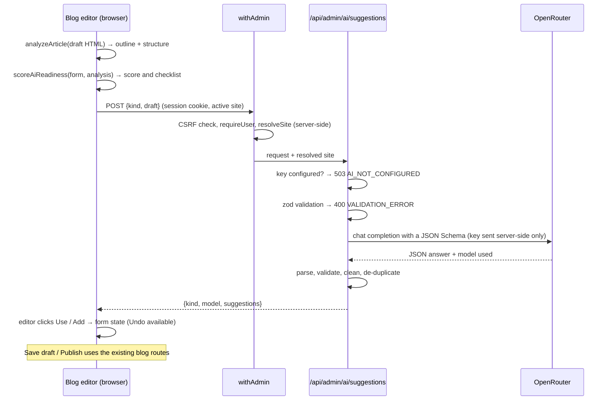

# AI writing assistant

The blog editor has an optional assistant that helps editors publish posts that answer engines such as ChatGPT, Perplexity, Gemini and Google AI Overviews can understand, quote and cite. It has four parts:

- **Title suggestions**: five headline options of at most 60 characters. Each can be used as the title or as the meta title.
- **Meta descriptions**: three summaries of 120–160 characters.
- **FAQs**: questions readers are likely to ask an AI assistant, answered from the post. They can be added one at a time or all at once, and are published as `FAQPage` structured data like hand-written FAQs.
- **AI-readiness score**: a 0–100 score with a checklist of what to fix. It is calculated in the browser from the draft and updates as you write.

The assistant only suggests. Nothing is saved until the editor applies a suggestion and saves the post through the normal editor flow.

## Setup

1. Create a key at [openrouter.ai/keys](https://openrouter.ai/keys). Free models need no credits.
2. Set `OPENROUTER_API_KEY` in `.env` (or in your host's secret settings) and restart the app.
3. Optionally set `OPENROUTER_MODELS` to up to three comma-separated model ids, tried in order. The default tries two free models that gave accurate answers in testing, then OpenRouter's free router (see [Models and reliability](#models-and-reliability)). For dependable speed, or for providers that do not retain data, choose a small paid model instead; it costs a fraction of a cent per suggestion.

Without a key the editor still shows the readiness score. The panel then explains that suggestions are off.

If OpenRouter reports that no model matches your account's privacy settings, check [openrouter.ai/settings/privacy](https://openrouter.ai/settings/privacy). Free endpoints are only available when the account allows them.

## How it works



- **Draft analysis** (`lib/ai/article.ts`) sanitizes and formats the editor HTML exactly as the render pipeline does, then walks it once. It produces a plain-text outline for the model (`## ` headings, `- ` list items) and the structure the score needs: headings, paragraph lengths, lists, tables and source links. The word count matches the stored rendered snapshot.
- **Score** (`lib/ai/readiness.ts`) is a pure function, so the same draft always gets the same score.
- **Route** (`app/api/admin/ai/suggestions/route.ts`) uses `withAdmin` like every admin route. `GET` reports whether suggestions are enabled, so the editor can explain setup before anyone clicks. `POST` returns suggestions and stores nothing.
- **Prompts** (`lib/ai/suggestions.ts`) put the site name and locale (from the server-resolved site, never from the request body) and the article first, and the task last. The system prompt tells the model to use only facts from the article and to ignore instructions inside it.
- **Provider client** (`lib/ai/openrouter.ts`) sends one request with `response_format: json_schema` (strict) and OpenRouter's response-healing plugin, parses the answer defensively and maps every provider failure to the CMS error envelope.
- **Editor** (`components/blog-editor/ai/`) shows the score on the toolbar button and opens a side panel. Applying a title updates an auto-generated slug exactly as typing does, and opens the SEO or Structured content section that changed.

## Models and reliability

Free models are shared and best-effort. Live testing with a free key shaped these choices:

- **Tested models first.** On its own, `openrouter/free` picked a different model for each request: a strong 120B model, a 2.6B model whose titles invented facts ("plan two months" for a quarterly calendar), a content-safety classifier that answered `User Safety: safe`, and reasoning models that ran out of tokens. The default list therefore starts with `nvidia/nemotron-3-super-120b-a12b:free` (accurate every time it was available) and `google/gemma-4-31b-it:free`. OpenRouter moves down the list when a model is rate-limited or down, and its free router is the last resort.
- **Reasoning off.** The preferred free models reason by default, which took about 30 s per request. Suggestions this short do not need it: with `reasoning: { enabled: false }` the same meta descriptions took 2–7 s. Models that must reason reject the setting, and OpenRouter moves to the next model.
- **One quick retry.** An unusable answer (empty, cut off, not JSON, or nothing left after cleanup) that arrives within 20 s came from an unsuitable model, so the request is repeated once; routers usually pick another model. Both attempts share the 55 s deadline.
- **Retired models.** OpenRouter rejects a whole list if one id no longer exists. When that happens to the built-in list, the request is retried with `openrouter/free` alone and the server logs a warning. A list set in `OPENROUTER_MODELS` is never second-guessed.
- **Length targets.** Models count words better than characters, and still vary. The prompt asks for 5 meta descriptions of 15–22 words, and the three closest to 120–160 characters are returned.

Expect free suggestions in roughly 2–30 seconds, with an occasional "try again" when every free model is busy. A paid model avoids both.

## AI-readiness checks

Each check is something the editor can fix in this screen. A pass earns the full weight, a warning half and a failure nothing. The grade is **Ready** from 80, **Needs work** from 50 and **Not ready** below 50.

| Check                                          | Weight | Pass                           | Warning                           | Suggestion        |
| ---------------------------------------------- | ------ | ------------------------------ | --------------------------------- | ----------------- |
| Search title (meta title, or title when unset) | 10     | 30–60 characters               | Any other length                  | Titles            |
| Meta description                               | 15     | 120–160 characters             | Any other length                  | Meta descriptions |
| Summary up front (subtitle)                    | 10     | 50+ characters                 | 1–49 characters                   | —                 |
| Key takeaways                                  | 10     | 3 or more                      | 1–2                               | —                 |
| FAQs with an answer                            | 15     | 3 or more                      | 1–2                               | FAQs              |
| Section headings                               | 10     | 2+ H2/H3 and no H1 in the body | One heading, or an H1 in the body | —                 |
| Depth                                          | 10     | 600+ words                     | 300–599 words                     | —                 |
| Lists or tables                                | 5      | At least one                   | —                                 | —                 |
| Short paragraphs                               | 5      | None over 120 words            | A longer paragraph                | —                 |
| Links to sources                               | 5      | At least one http(s) link      | —                                 | —                 |
| Named author                                   | 5      | Author chosen                  | —                                 | —                 |

These are common answer-engine optimisation practices: a direct summary, question-and-answer content, sections that can be quoted on their own, structured passages, sources and named authorship. The score measures how well a post is prepared. It does not predict how any particular engine ranks it.

## Design decisions and trade-offs

| Decision                                                           | Alternative considered                               | Why                                                                                                                                                                                                                                                         | Cost                                                                                                                |
| ------------------------------------------------------------------ | ---------------------------------------------------- | ----------------------------------------------------------------------------------------------------------------------------------------------------------------------------------------------------------------------------------------------------------- | ------------------------------------------------------------------------------------------------------------------- |
| **Deterministic readiness score**, calculated in the browser       | Ask the model for a score                            | Requests can be answered by different models, so a model's score would change between clicks for the same text. A rule-based score is instant, free, testable and explains itself, and it immediately reflects suggestions the editor applies.              | It measures structure, not writing quality. The AI does the writing; the score checks the result.                   |
| **Suggest, never write**                                           | Generate straight into the post, or save server-side | The editor reviews every suggestion, and the existing save path validates and renders it. No schema change, no new write path, and `/api/v1` is untouched.                                                                                                  | Applying takes one click per suggestion (or **Add all** for FAQs).                                                  |
| **Plain `fetch` to OpenRouter's HTTP API**                         | OpenRouter, OpenAI or Vercel AI SDKs                 | One endpoint and one request shape do not justify a dependency. Timeouts and cancellation use `AbortSignal`.                                                                                                                                                | Retries and streaming are not built in; neither is needed here.                                                     |
| **JSON Schema output + response healing + tolerant parsing + zod** | Free-text answers parsed with regular expressions    | Free models vary. The schema constrains models that support it, healing repairs near-misses, and the parser also reads fenced or embedded JSON. zod then checks the shape, and the cleanup removes list markers, quotes, duplicates and out-of-range items. | Several layers of defence, each small and tested.                                                                   |
| **Tested free models, then the free router**, with reasoning off   | `openrouter/free` alone, or one pinned free model    | The router alone sometimes picked unsuitable models, and a single free model is often rate-limited. See [Models and reliability](#models-and-reliability).                                                                                                  | The built-in model ids need an occasional update; a retired one falls back to the router instead of failing.        |
| **The browser sends a plain-text outline, not HTML**               | Send editor HTML and parse it on the server          | The editor already analyses the draft for the score. Drafts can contain base64 images, so text keeps requests small.                                                                                                                                        | The server trusts the client's extraction. That is acceptable because the output only goes back to the same editor. |
| **Minimum draft length** (30, 50 and 150 words)                    | Allow generation from a title alone                  | With little text, models invent content. The editor disables the button with a hint, and the server enforces the same floor.                                                                                                                                | Very short posts cannot use the assistant.                                                                          |
| **Provider errors mapped, never forwarded**                        | Return OpenRouter's status                           | A provider 401 means the server's key is wrong, but the admin UI treats a 401 as an expired session. Failures become `AI_UNAVAILABLE` (502/504) or `RATE_LIMITED` (429 with `Retry-After`), with messages an editor can act on.                             | Two new error codes in the admin error envelope.                                                                    |
| **No `HTTP-Referer` attribution header**                           | OpenRouter app attribution                           | Attribution would list the private CMS origin in OpenRouter's public rankings.                                                                                                                                                                              | The installation does not appear in OpenRouter analytics.                                                           |
| **No app-level quota**                                             | A per-user token bucket in MongoDB                   | Every request is an explicit click by an authenticated editor. OpenRouter enforces account limits on free models (20 requests a minute, and 50 a day or 1,000 a day once 10 credits have been bought), and a key can have a credit limit.                   | A busy installation should add a per-user quota before editors share a paid key.                                    |

## Security and privacy

- The key is read on the server (`getEnv`) and sent only in the `Authorization` header to OpenRouter. It is never returned to the browser or logged. Errors log the provider's status and message only, never the article.
- Both routes use `withAdmin`: a signed-in user, site access and, for `POST`, the same-origin and JSON checks. The prompt uses the site that `withAdmin` resolved from the session; a `siteId` in the body is ignored.
- Suggestions are plain text rendered by React, so they cannot inject markup. Applied values go through the same validation as typed ones when the post is saved.
- **Generating sends the draft's title, subtitle, text, tags and keywords to OpenRouter and the model's provider.** Free endpoints may log prompts or use them for training, according to each provider's policy. The panel says so. For confidential drafts, choose a model whose providers do not retain data, and set the account's privacy preferences to match.

## API

`GET /api/admin/ai/suggestions` returns `{ "enabled": true, "models": ["nvidia/nemotron-3-super-120b-a12b:free", "google/gemma-4-31b-it:free", "openrouter/free"] }`, the models tried in order.

`POST /api/admin/ai/suggestions` with:

```json
{
  "kind": "titles",
  "draft": {
    "title": "Plan a content calendar",
    "excerpt": "Three months of posts in one afternoon.",
    "text": "## Why plan\n\nPlanning ahead keeps a small team consistent…",
    "keywords": "content calendar",
    "tags": ["Guides"],
    "faqQuestions": []
  }
}
```

`kind` is `titles`, `metaDescriptions` or `faqs`. `text` is at most 20,000 characters. The response is `{ kind, model, suggestions }`. `suggestions` holds strings for titles and meta descriptions, and `{ question, answer }` objects for FAQs. `model` is the model that answered.

| Status    | Code                                          | When                                                                                  |
| --------- | --------------------------------------------- | ------------------------------------------------------------------------------------- |
| 400       | `VALIDATION_ERROR`                            | Unknown kind, oversized field, or too little text for the kind                        |
| 401 / 403 | `UNAUTHORIZED`, `FORBIDDEN`, `SITE_FORBIDDEN` | Not signed in, cross-site request, or no access to the site                           |
| 429       | `RATE_LIMITED`                                | OpenRouter rate limit or daily free quota (`Retry-After` when OpenRouter sends one)   |
| 502 / 504 | `AI_UNAVAILABLE`                              | Key rejected, model unavailable, content declined, unusable answer, or timeout (55 s) |
| 503       | `AI_NOT_CONFIGURED`                           | `OPENROUTER_API_KEY` is not set                                                       |

## Tests

- Unit: `lib/ai/*.test.ts` covers draft analysis, every score threshold, prompts and output cleanup, the quick retry and the retired-model fallback, the provider client's request shape, parsing and error mapping, and the browser client. `lib/validation/ai-suggestions.test.ts` covers request limits. `lib/env.test.ts` and `lib/http/errors.test.ts` cover the new settings and error codes.
- Integration: `tests/integration/api/admin-ai-suggestions.test.ts` runs the real `withAdmin` against a temporary MongoDB with the provider call stubbed. It checks the enabled status, a successful request bound to the server-resolved site, cross-site and cross-origin rejection, the missing-key and validation errors, and rate-limit and bad-key mapping. None of the rejected requests reach the provider.
- `app/api/admin/routes.test.ts` includes the new route in the anonymous-access inventory.

## Limitations and future work

- The score reflects structure and completeness, not accuracy or writing quality. A later version could add an optional AI review that explains the weakest section, kept separate from the score.
- Free models are best-effort: answers usually take 2–30 seconds and sometimes fail when every free model is busy. Suggestions are not streamed; the panel shows progress with a Cancel button.
- Only blog posts have the assistant. The same route could serve whitepapers and release notes.
- Key takeaways and subtitles are scored but not generated.
- There is no per-user quota or usage log; see the design table.
- Image alt text is not scored, because the editor has no way to edit it yet.
